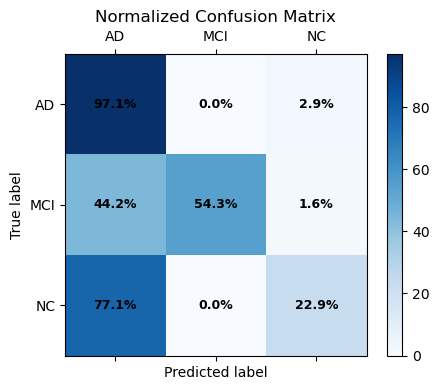
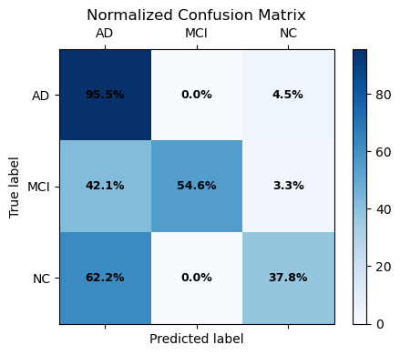
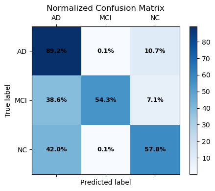
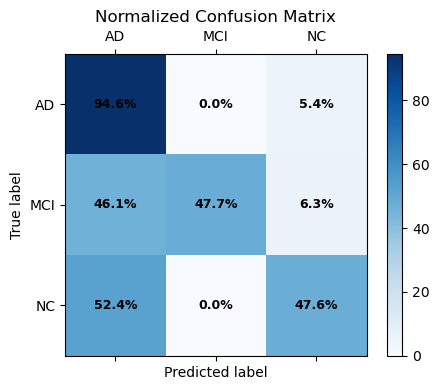
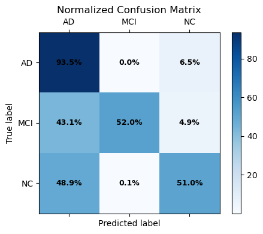

# Designing a Strategy for Model Comparison in the Non-Invasive Diagnosis of Alzheimer’s Disease

## Overview
This project investigates computational strategies for improving the non-invasive diagnosis of Alzheimer’s Disease (AD).  
The focus lies on leveraging **microRNA (miRNA) biomarkers**, measurable in fluids such as blood, which have shown promise in distinguishing healthy individuals, mild cognitive impairment (MCI), and Alzheimer’s patients.  

Rather than prescribing a single predictive model, the project aims to establish a **rigorous framework for model comparison**, ensuring results are robust and reproducible despite challenges such as limited sample size and class imbalance.

---

## Motivation
Alzheimer’s Disease remains one of the most pressing neurological disorders, where **early detection** is critical to effective treatment. Traditional approaches rely heavily on invasive or costly diagnostic tools.  
This project addresses the problem by exploring **non-invasive, biomarker-driven classification**, aiming to enhance diagnostic precision and contribute to the broader effort of integrating machine learning into clinical research.

---

## Method
The methodological focus is twofold:
1. **Preprocessing and Feature Engineering**  
   - Data cleaning, normalization, and dimensionality reduction via PCA.  
   - Addressing strong class imbalance using re-sampling and class-weighting strategies.  

2. **Model Development and Comparison**  
   A set of machine learning models are evaluated under a standardized training and validation pipeline, including:
   - **Random Forest** (baseline and enhanced with resampling)  
   - **XGBoost** (with class weighting)  
   - **Support Vector Machine (RBF kernel)**  
   - **Hierarchical classification strategy** (two-phase separation of classes, mirroring clinical reasoning)  

To ensure fairness and generalizability, **nested cross-validation with repeated stratification** is adopted, enabling robust hyperparameter tuning and unbiased performance assessment.

---

## Intended Experiments & Evaluation
Experiments are designed to compare models across multiple perspectives of performance in a **ternary classification task (AD vs MCI vs Normal Controls)**.  

- **Primary metrics**:  
  - Balanced Accuracy  
  - F1-Macro  
  - PR-AUC (Macro)

- **Evaluation procedure**:  
  - Performance reported as mean ± standard deviation across folds.  
  - Statistical significance assessed through t-tests and Wilcoxon signed-rank tests.  

The comparative analysis emphasizes **robustness over isolated performance peaks**, aiming to highlight models that perform consistently across all classes, including minority groups such as MCI patients.

---

## Outcomes

  
  
  

Preliminary findings show that **XGBoost with class weighting** consistently outperforms other strategies, offering balanced detection across classes. Hierarchical approaches and resampling-enhanced Random Forests also demonstrate competitive results, highlighting the relevance of ensemble methods for this problem.  

|  |  |  |
|---------------------------|----------------------------|----------------------------|
| Baseline (original data)  | Baseline                   | Random Forest + resampling |

|  |  |  |
|---------------------------|----------------------------|----------------------------|
| XGB + class weighting     | SVM with RBF kernel        | Hierarchical model         |

Future directions include exploring more advanced feature selection, hybrid hierarchical methods, and integration with multi-omics data to further boost interpretability and predictive power.

---
